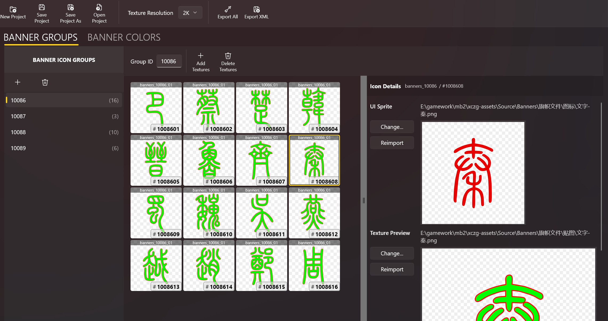

# Banner Icon Editor

Adding customer banners to Bannerlord can be quite cumbersome.

You'll have to create the 4x4 textures, organize the sprites, edit XML files, and so on. It's a lot of work, and it's easy to make mistakes.

BLIT can manage the config and assets for you, including:

- Banner icon groups
- Banner icon textures
- Banner icon sprites
- Custom colors

Your work will be saved as **Bannerlord Icon Project**s, or `bip` files, which can be exported with just one-click and then imported in your mod.
