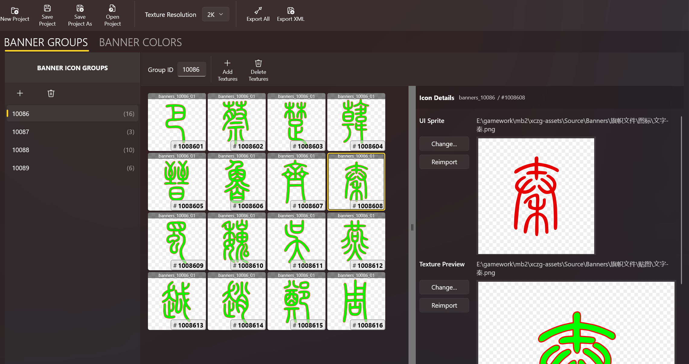

# 旗帜图案编辑器

在骑砍 2 中添加新的旗帜资源是一件很麻烦的事情。
Adding customer banners to Bannerlord can be quite cumbersome.

你必须创建 4x4 的贴图文件，组织好图标文件，编辑 XML 文件等等。不但要处理的东西很多，而且很容易出错。

BLIT 可以帮你管理自定义旗帜图案的配置文件和资源，包括：

*   旗帜图组
*   旗帜图案贴图
*   旗帜 UI 图标
*   自定义颜色

你的配置将会保存为 **旗帜图案工程** (`.bip` 文件)，并可以一键导出，然后再导入的你的 MOD 中。
