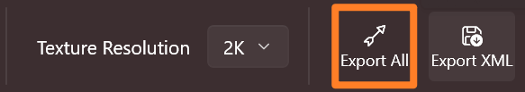
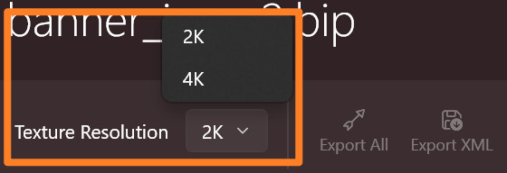

import { FileTree } from "nextra/components";

# Export Banner Assets

You can select either to export all assets or only the banner config XML file.

## Complete Export

Click the **Export All** button in the toolbar and select a destination folder to export:

A complete export will generate the following outputs:

<FileTree>
  <FileTree.Folder name="Target Folder" defaultOpen>
    <FileTree.File name="banner_icons.xml" />
    <FileTree.Folder name="AssetSources" defaultOpen>
      <FileTree.Folder name="BanneerIcons" />
    </FileTree.Folder>
    <FileTree.Folder name="GUI" defaultOpen>
      <FileTree.Folder name="SpriteParts" defaultOpen>
        <FileTree.File name="Config.xml" />
        <FileTree.Folder name="ui_<GROUP ID>" />
      </FileTree.Folder>
    </FileTree.Folder>
  </FileTree.Folder>
</FileTree>

| File/Folder                | Description                                                                                                                                                                                                                                        |
| -------------------------- | -------------------------------------------------------------------------------------------------------------------------------------------------------------------------------------------------------------------------------------------------- |
| banner\_icons.xml           | Put it in the **ModuleData** folder of your mod.                                                                                                                                                                                                   |
| AssetSources               | The merged banner textures (PSD files), which can be imported by Bannerlord Modding Kit directly.                                                                                                                                                  |
| GUI/SpriteParts/ui\_\*     | The sprite folders for sprite sheet generation.                                                                                                                                                                                                    |
| GUI/SpriteParts/Config.xml | The config file for setting the banner sprites as `<AlwaysLoad>` so that you don't have to manually load the sprite sheets in code. Use it wisely.    You will probably need to merge its content with your existing `Config.xml`, if any. |

***

## Export XML Only

If you have only changed the banner colors and won't want to wait for all the textures to be packed again (it could take a long time!),
you can choose to generate only the `banner_icons.xml` file.

To do so, click the **Export XML** button in the toolbar and pick the output *folder*.

***

## Texture Resolution

By default, each merged texture will be in 2K resolution, i.e. 2048x2048 pixels. Since each texture is tiled 4x4, the packed icon textures will be sized to 512x512 pixels.

This is the recommended configuration, as banners are typically too small for the resolution to be noticable.
Smaller textures will reduce the size of your mod as well as conserve RAM and vRAM.

However, if you do wish a larger texture, you can select **4K resolution** before exporting. This will enlarge the merged textures to 4096x4096 pixels (1024x1024 pixels for each icon).

