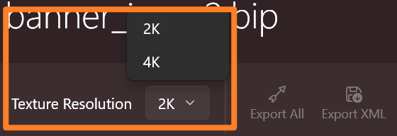

import { FileTree } from "nextra/components";

# 导出资源

你可以选择导出全部资源，或只导出旗帜的配置文件。

## 完整导出

点击工具栏中的 **全部导出** 按钮，并选择一个目标文件夹来导出：

全部导出后，会在目标文件夹中生成以下文件：

<FileTree>
  <FileTree.Folder name="目标文件夹" defaultOpen>
    <FileTree.File name="banner_icons.xml" />
    <FileTree.Folder name="AssetSources" defaultOpen>
      <FileTree.Folder name="BanneerIcons" />
    </FileTree.Folder>
    <FileTree.Folder name="GUI" defaultOpen>
      <FileTree.Folder name="SpriteParts" defaultOpen>
        <FileTree.File name="Config.xml" />
        <FileTree.Folder name="ui_<图组ID>" />
      </FileTree.Folder>
    </FileTree.Folder>
  </FileTree.Folder>
</FileTree>

| 文件/文件夹                | 描述                                                                                                                                                                                                                                        |
| -------------------------- | --------------------------------------------------------------------------------------------------------------------------------------------|
| banner\_icons.xml          | 旗帜图案配置文件，放到你的 MOD 的 **ModuleData** 文件夹下|
| AssetSources               | 合并后的贴图文件 (PSD 文件),可以直接在官方编辑器 Modding Kit 中导入。|
| GUI/SpriteParts/ui\_\*     | 用于生成图集 (Sprite Sheet) 的图标文件。|
| GUI/SpriteParts/Config.xml | 为图标资源添加 `<AlwaysLoad>` 配置，以便开启默认加载，视情况使用。    如果你的 Mod 已经有了 `Config.xml` 配置，那么需要手动合并内容。|

***

## 只导出 XML

如果你只修改了自定义颜色，而不希望花很长时间等待重新打包贴图，那么你可以选择只导出 `banner_icons.xml` 文件。

要这样做，请单击工具栏中的 **Export XML** 按钮并选择输出的 *文件夹*。

***

## 贴图分辨率

默认情况下，每张合并的贴图都是 2K 分辨率，即 2048x2048 像素。由于每张合并贴图包含 4x4 个图案贴图，因此最终的图标贴图将被调整为 512x512 像素。

建议使用这个默认配置，因为在游戏中，旗帜通常都比较小，玩家并不会注意到分辨率的差异。使用较小尺寸的贴图，不但可以减少 MOD 的大小，还可以节省内存和显存。

但如果确实想要尺寸大一点的贴图，可以在导出前选择 **4K resolution**。这将把合并的贴图放大到 4096x4096 像素 (每个图标 1024x1024 像素)。

