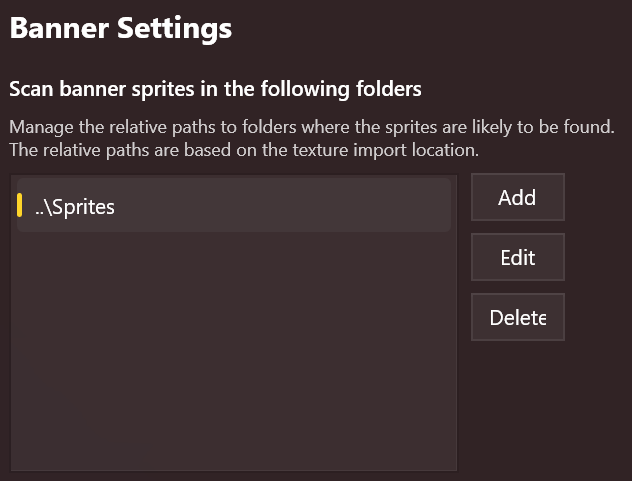
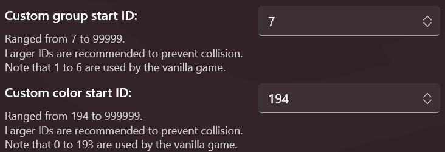

import { FileTree } from "nextra/components";

## First-Run Setup

To better managing your banner assets, you will need to tweak the banner settings on your first run for features like sprite searching as well as start IDs for groups and colors. BLIT will remember your settings.

First, in the navigation pane, click **Settings**.

### Relative Sprite Scan Paths

BLIT scans for corresponding sprites for banner textures via _relative_ scan paths, which are relative to the location of the texture files.

For instance, if you have banner assets stored in a directory structure like this:

<FileTree>
  <FileTree.Folder name="My Work" defaultOpen>
    <FileTree.Folder name="Textures" defaultOpen>
      <FileTree.File name="AwesomeBanner.png" />
    </FileTree.Folder>
    <FileTree.Folder name="Sprites" defaultOpen>
      <FileTree.File name="AwesomeBanner.png" />
    </FileTree.Folder>
  </FileTree.Folder>
</FileTree>

Then you should add `..\Sprites` as the search path. When importing the texture `AwesomeBanner.png`, BLIT will search for the sprite at `MyWork\Sprites\AwesomeBanner.png`.

**Note that** BLIT will search for the sprite with **the _same_ file name of the texture**.

> BLIT DO NOT support scanning for sprites in the directory of textures (i.e. `.\`), because you can't have two files with the same name in the same directory.

### Start IDs

Each banner icon group must have a unique ID, so do the banner colors. To avoid conflicts with the native game and other mods, you should set a start ID for your mod.

For example, if you set the group start ID as `10000`, whenever you create the first group in a new project, its ID will be `10000`.

Please read the hints below each setting's name about the restrictions.
