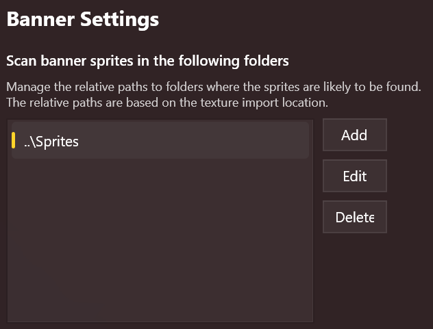
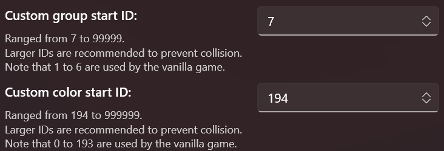

import { Callout, FileTree } from "nextra/components";

## 首次运行设置

为了能更好地管理旗帜资源，首次运行旗帜图案编辑器时，你需要调整一些设置，包括 UI
图标的搜索路径、图组和颜色的起始 ID 等。BLIT 会记住你的设置。

首先，在导航栏中点击**设置**。

### UI 图标相对扫描路径 \[#relative-scan-path]

BLIT 可以通过*相对扫描路径*，自动扫描贴图文件对应的 UI
图标文件。注意，扫描路径是相对于贴图文件所在位置的。

举例来说，如果你的资源文件存放在这样的目录结构中：

<FileTree>
  <FileTree.Folder name="我的作品" defaultOpen>
    <FileTree.Folder name="贴图" defaultOpen>
      <FileTree.File name="霸气的图案.png" />
    </FileTree.Folder>
    <FileTree.Folder name="图标" defaultOpen>
      <FileTree.File name="霸气的图案.png" />
    </FileTree.Folder>
  </FileTree.Folder>
</FileTree>

那么你应该在扫描路径中添加一条记录： `..\图标`。当导入贴图文件 `霸气的图案.png`
时，BLIT 会在 `我的作品\图标` 目录下自动寻找同名的图标文件。

**注意**，BLIT
是通过寻找同名文件来确定图标文件的，所以你应该保证贴图文件和图标文件的文件名相同。

<Callout>
  `..\` 代表上一级目录，`.\` 代表当前目录。   BLIT **不**支持扫描当前目录下的图标（即扫描路径不能为
  `.\`），因为同一目录下不能有两个同名的文件；但你可以把图标放在贴图文件夹的子目录中，比如 `.\图标`。
</Callout>

### 起始 ID

每个图组或自定义颜色都需要一个唯一的 ID。为了避免与原版游戏或其他 MOD 的 ID
冲突，你应该为你的 MOD 设置一个起始
ID，这样在添加新组或颜色时，就不用每次都手动修改 ID 了。

比如说，如果你的图组起始 ID 是 `10000`，那么在新项目中创建第一个图组时，它的 ID 就会是 `10000`。

请阅读每个设置下的说明来了解关于 ID 的范围限制。
