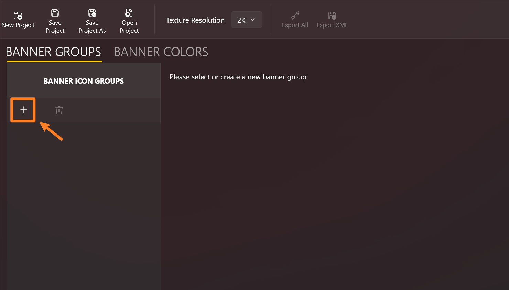
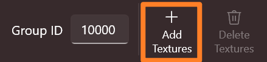
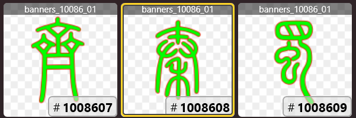
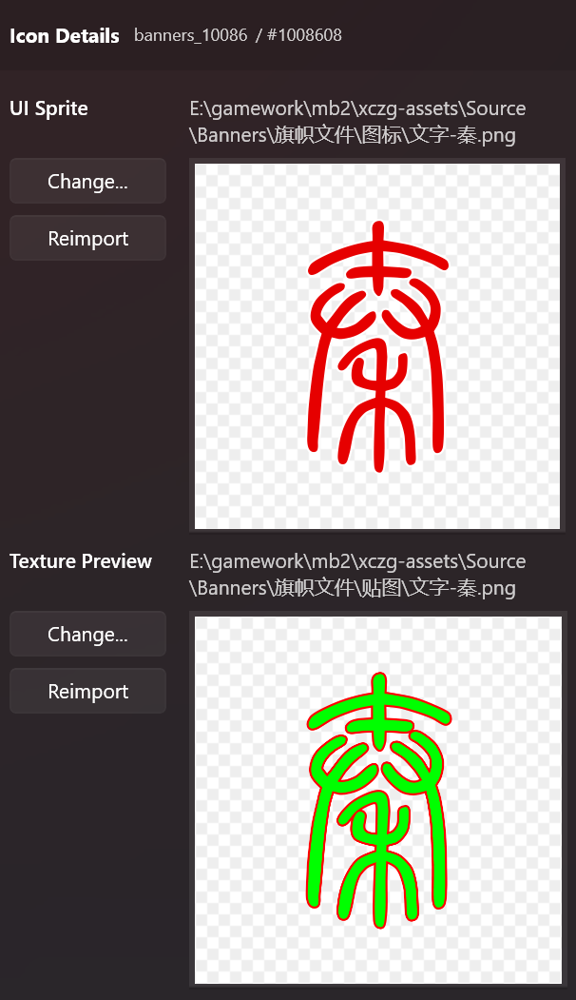

# Import Banner Icons

## What are Banner Icons?

"Icons" are the images for composing sigils in the game.

Each banner icon consists of two assets: a texture and a sprite.
The texture is the image that is rendered to the 3D mesh and the sigils (for example, in the encyclopedia), while the sprite is the image that shown in the UI list when designing a banner.

---

## Manage groups

Go to **Banner Icons** via the navigation pane. If you haven't opened a project, it wll create an empty one for you automatically, containing no groups or colors.

Banner icons are organized in groups. Although Bannerlord banner editor doesn't show the groups in the UI, it's a good way of grouping your banner icons logically,
which will make things easier if you decide to add or remove icons later.

So let's create a new group by clicking the plus button:

You'll notice that with the new group selected, the group editor shows up in the right pane.

Click **Add textures** and select your banner texture files. You can, of course, import mulitple textures in a batch.

The imported textures will show in the list, each of which is assigned with an **Icon ID**, the unique identifier in the game.

> The Icon IDs are comprised of the group ID and the texture index in the group.

You can also find the file name of the merged texture where an icon belongs -- it's the text at the top of each tile
in the format of `banner_<group ID>_<texture index>`. Since every merged texture can hold only 16 icon textures,
there could be more than one texture files (suffixed with `_01`, `_02`, etc.) for a single icon group.

---

## Icon details

When an icon is selected, its detail will show up in the rightmost pane,
where you can inspect the texture and the sprite in a larger view.

If you have set the [relative sprite scan paths](./first-run#relative-sprite-scan-paths) correctly, and the sprite file names are identical to the textures',
BLIT will automatically fill in the sprites for the icons.

You can always pick sprites and textures manually for each icon by clicking the **Change...** button.

If an image has changed on your disk, you'll have to click **Reimport** to refresh it in the editor.

> Alternatively, you can reimport the textures by clicking **Add textures** and select those files again, if there are many images to be refreshed.

