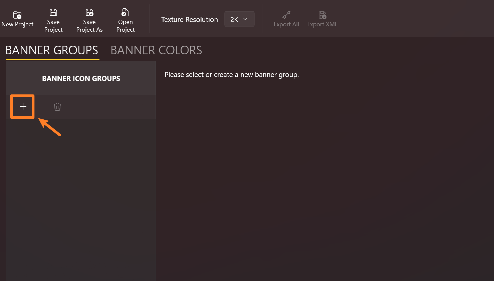
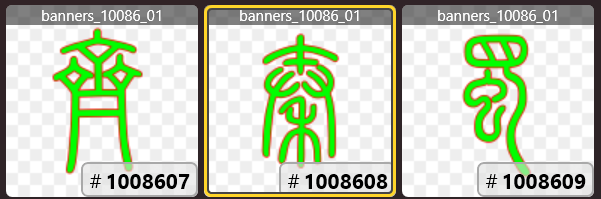
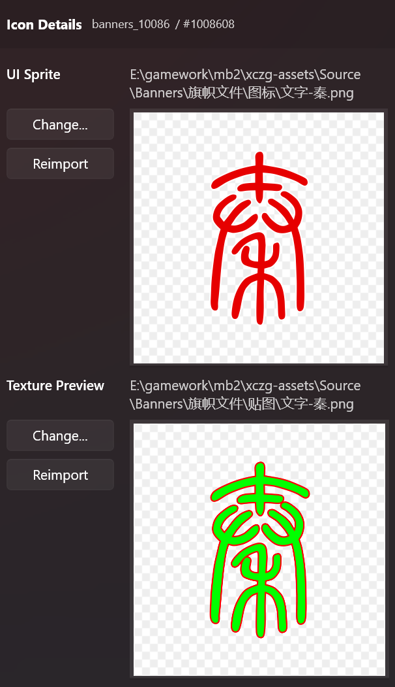

# 导入旗帜图案

## 什么是旗帜图案?

"图案"是游戏中组成旗帜或纹章的图片。

每个旗帜图案都由两部分组成：贴图和 UI 图标（即 Sprite。文档中会简称图标）。
贴图文件在游戏中会被渲染到 3D 模型和纹章图片上（比如百科中），而 UI 图标则是在设计旗帜时，显示在图案列表中的图片。

***

## 管理图组

在导航面板点击 **自定义旗帜** 进入编辑器。如果目前没有任何已打开的旗帜项目，编辑器会自动创建一个没有图标组和颜色的空项目。

游戏使用图组来归纳旗帜图案。尽管在游戏中的旗帜编辑器并不会分组显示图案，但按逻辑来分类归纳图案是一个更好的做法 ——
日后如果需要添加或移除图案，你会发现在一个小分组内操作会容易得多。

我们点击加号按钮来添加一个新组：

选中新建的图组后，右边的面板会显示图组编辑器。

点击 **添加贴图** 按钮并选择要导入的旗帜贴图文件。你可以一次性导入多个贴图。

导入的贴图显示在列表中。每个贴图都会被分配一个 **图标 ID**，这是游戏中的唯一标识符。

> 图标 ID 由图组 ID 和贴图在图组中的编号组成。

你还可以在每个图块的顶部看到合并后的贴图文件名，格式为
`banner_<图组ID>_<贴图编号>`。由于每个合并后的贴图文件只能容纳 16 个图标贴图，
所以一个图组可能会生成好几张合并贴图，以后缀 `_01`、`_02` 等来表示 。

***

## 图案详情

当一个图标被选中后，右侧会出现它的详情界面。你可以在这里检查贴图和图标的大图。

如果你之前设置了[UI图标的相对扫描路径](./first-run#relative-scan-path)，同时贴图文件名和图标的文件名相同，
那么图标文件应该已经自动填上了。

有需要的话，也可以点击 **更改...** 按钮来手动导入一张图标或贴图文件。

如果磁盘上的图片文件被修改了，你需要点击 **刷新** 按钮来重新导入贴图。

> 如果要重新导入很多图，也可以再次点击 **添加贴图** 按钮并重新选择那些文件，来实现批量重新导入的效果。

