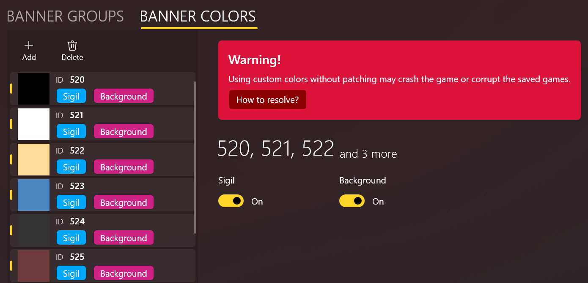

import { Callout } from "nextra/components";

# Manage Custom Colors

## ☣️ DANGER! ☣️[#color-danger]

**DO NOT** add **ANY** custom color, if you haven't done one of the followings:

- Patched the native `BannerManager.GetColorId` method to support discontinous color IDs.
- Using a banner enhancement mod that supports custom colors (such as [Banner Editor](https://www.nexusmods.com/mountandblade2bannerlord/mods/4944)). 
  **Note that** you have to make sure _all_ your mod players have also installed such a mod!

Otherwise, it will **crash your game and corrupt the saved games**!!!

<Callout>
  I have reported this bug to TaleWorlds but the fix is still in progress. You
  can help bump this
  [thread](https://forums.taleworlds.com/index.php?threads/game-crash-if-banner-color-ids-are-not-continuous-from-194.459436/).{" "}
   
  For more technical details, or if you want to patch it in your own mod, please
  refer to [How To Support Custom Colors](./how-to-patch-color).
</Callout>

---

## Edit colors

To manage custom colors, click **BANNER COLORS** under the banner editor's toolbar:

Editing colors should be pretty straightforward -- just click **Add** to add a new color and **Delete** to remove the selected color.

For each color, you can toggle the **Sigil** and **Background** switches to determine whether this color can be used in the sigil and/or background palettes in the game.

You can also change the color ID manually, as long as it's unique. BLIT will prevent color IDs from being duplicated in a single project.

## Multi-selection

You can delete multiple colors by muti-selection (via the <kbd>Shift</kbd> or <kbd>Ctrl</kbd> key). When more than one color are selected, however, you won't be able to edit the ID nor the color.

