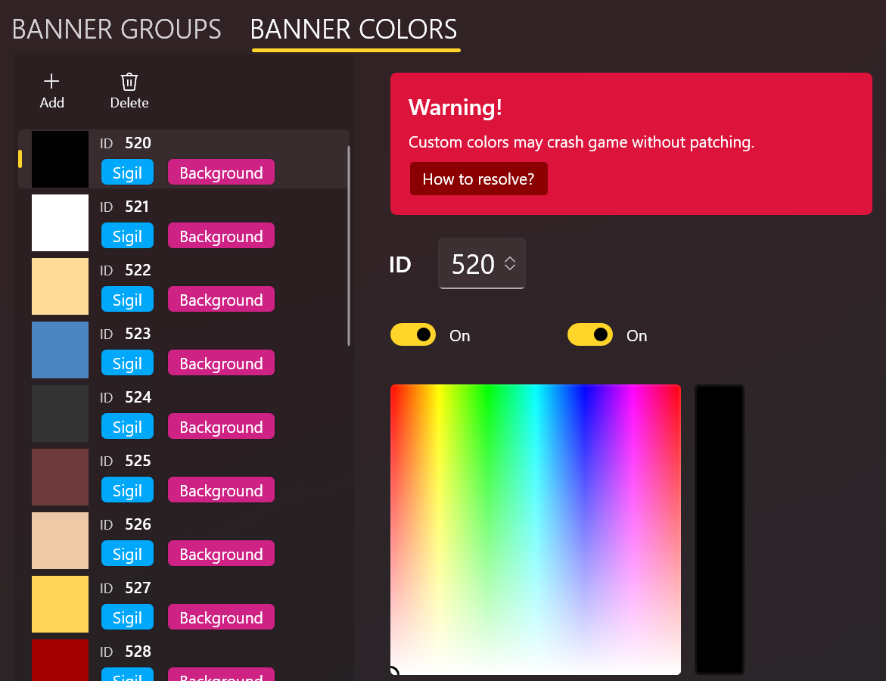
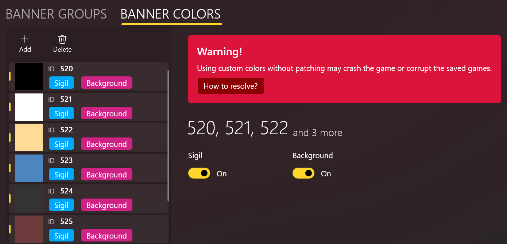

import { Callout } from "nextra/components";

# 管理自定义颜色

## ☣️ 危险操作! ☣️[#color-danger]

如果不能确定满足下面的条件，**千万不要**添加**任何**自定义颜色：

- 你已经通过编写 Harmony 补丁，修复了原生的 `BannerManager.GetColorId` 方法，使其能够支持不连续的颜色 ID。
- 你正在使用支持自定义颜色的旗帜增强模组（例如 [Banner Editor](https://www.nexusmods.com/mountandblade2bannerlord/mods/4944)）。 
  ⚠️ **注意**，你必须确保你**所有**的 MOD 玩家都安装了这样的模组！

否则，自定义颜色会导致 **游戏崩溃并损坏存档**！！！

<Callout>
  我已经和 T 社报告了这个 BUG，但目前还未修复。你可以帮忙
  [顶帖](https://forums.taleworlds.com/index.php?threads/game-crash-if-banner-color-ids-are-not-continuous-from-194.459436/)。
    想了解更多的技术细节，或者想在你自己的 MOD 中修复这个问题，请参考[如何支持自定义颜色](./how-to-patch-color)。
</Callout>

---

## 编辑颜色

要编辑自定义颜色，请在旗帜编辑器工具栏的下方，点击 **自定义颜色** 页面：

颜色编辑器是很直观的：点击 **添加** 按钮添加新颜色，点击 **删除** 按钮删除选中的颜色。

通关切换 **纹章色** 和 **背景色** 开关，你可以决定是否允许玩家在游戏中对应的调色板上选择这个颜色。

通过颜色编辑器，你也可以编辑每个颜色的 ID。ID 必须是唯一的，不过 BLIT
会避免出现重复ID。

## 多选

你可以通过 <kbd>Shift</kbd> 或 <kbd>Ctrl</kbd> 键进行多选从而进行批量删除等操作。当多个颜色被选中时，你将无法编辑 ID 和颜色值。

